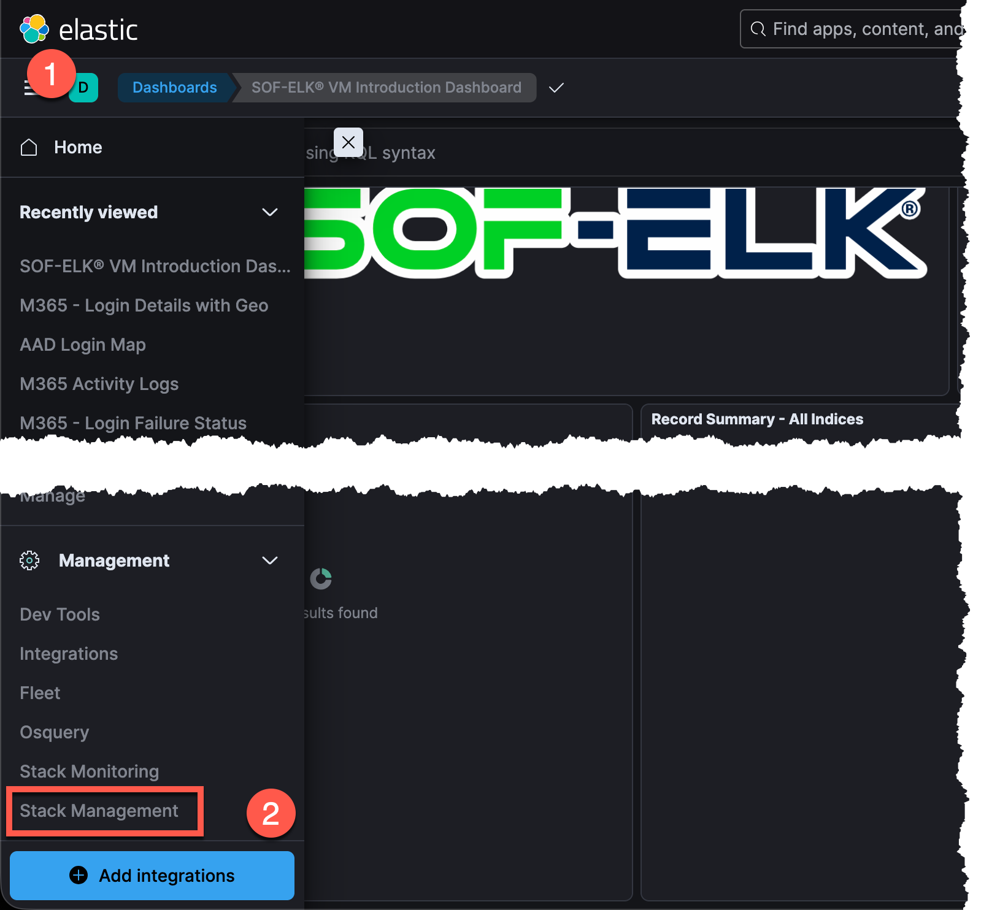
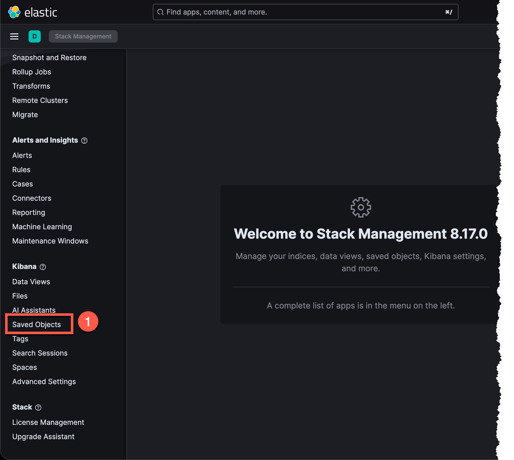
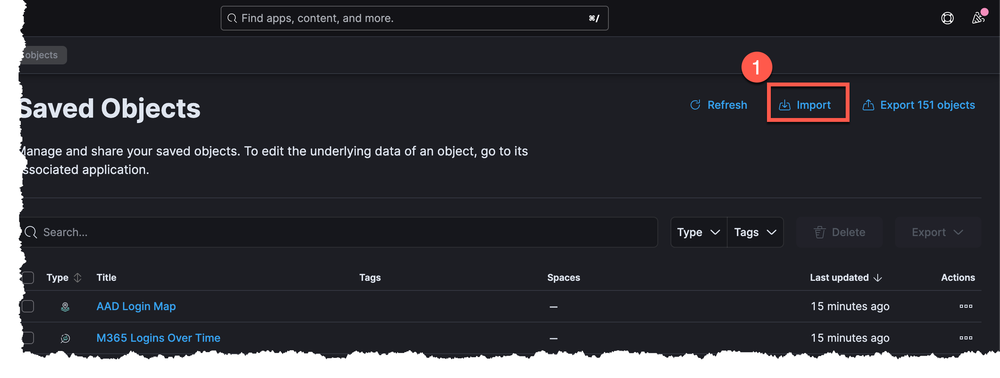
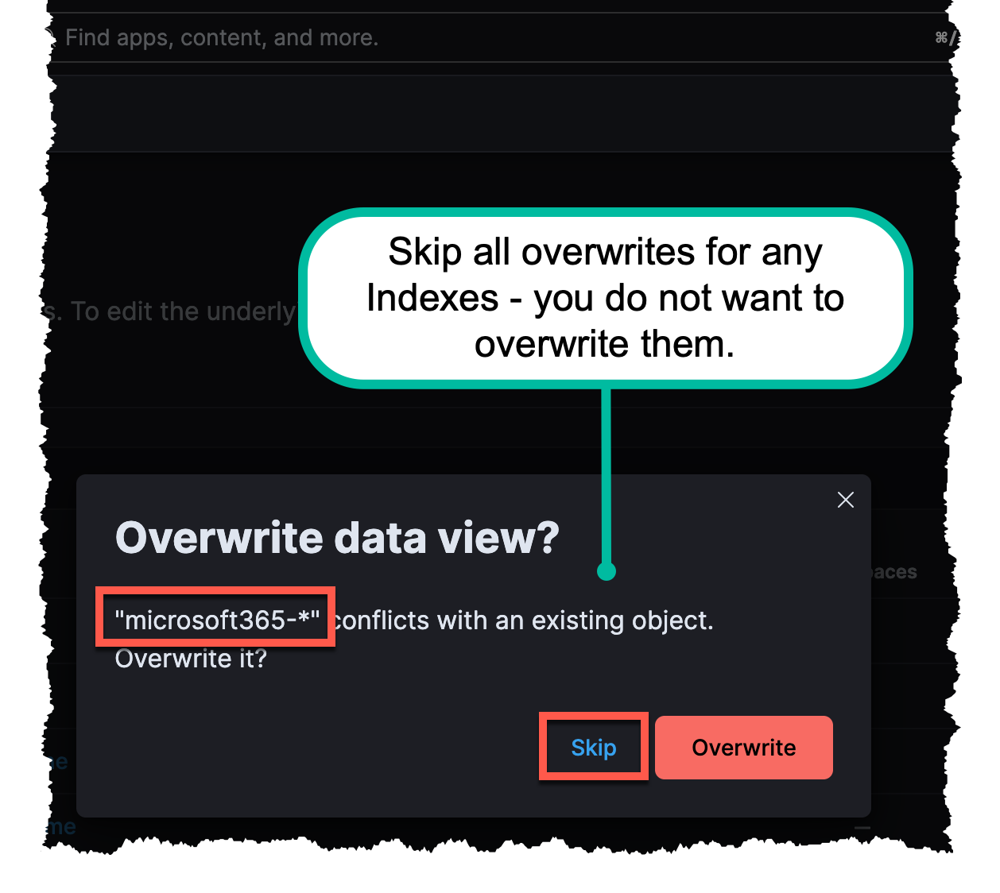

# SOF-ELK DFIR Dashboards

These are a few [SOF-ELK](https://github.com/philhagen/sof-elk) Dashboards that I've built and found useful for DFIR Cases. You're welcome to use these or suggest updates to them via Pull request.

A lot of these Dashboards were developed from performing Cloud log analysis, but hopefully it will include others....as I get time to create them.

## Dashboards

* [Microsoft 365 UAL Dashboard](/dashboards/M365%20UAL%20Dashboard.ndjson)

## Pre-ECS Dashboards (Older SOF-ELK)

* [Microsoft 365 UAL Dashboard](/dashboards/Pre-ECS%20Dashboards/M365%20UAL%20Dashboard.ndjson)
* [Google Workspace Dashboard](/dashboards/Pre-ECS%20Dashboards/GWS%20Dashboard.ndjson)
* [Google Cloud Dasboard](/dashboards/Pre-ECS%20Dashboards/Google%20Cloud%20Dashboard.ndjson)
* [AWS Kubernetes Dasboard](/dashboards/Pre-ECS%20Dashboards/AWS%20K8%20Dashboard.ndjson)

## Import Instructions

### Step 1

### Step 2

### Step 3

### Step 4

### Step 5

